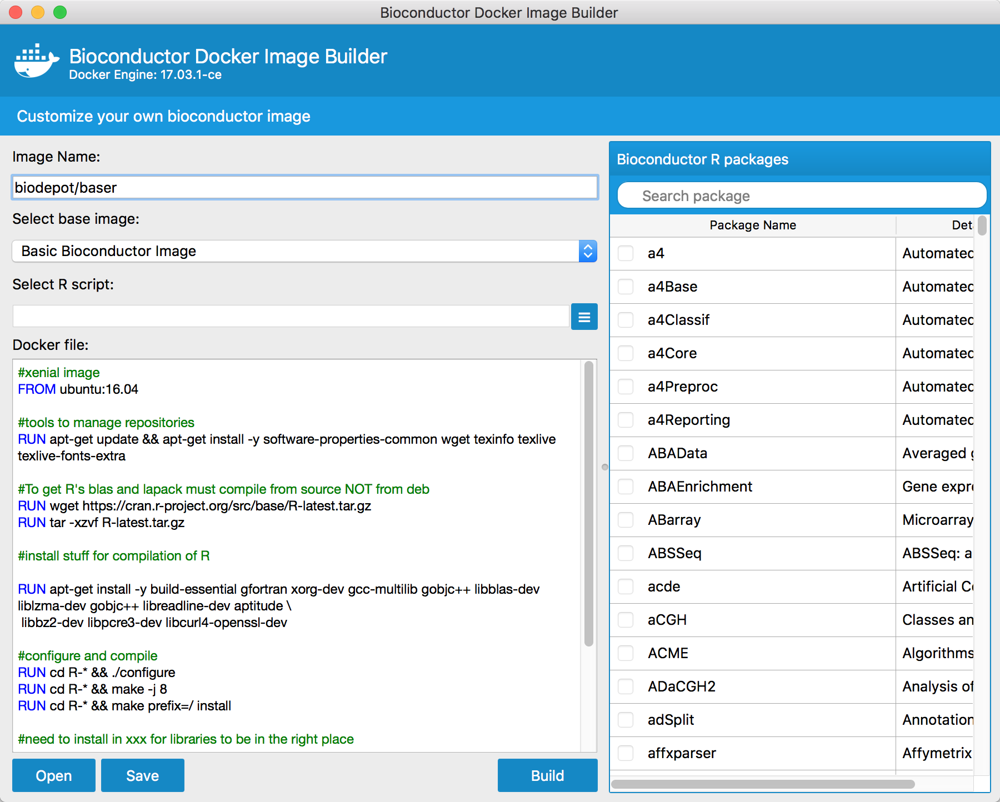
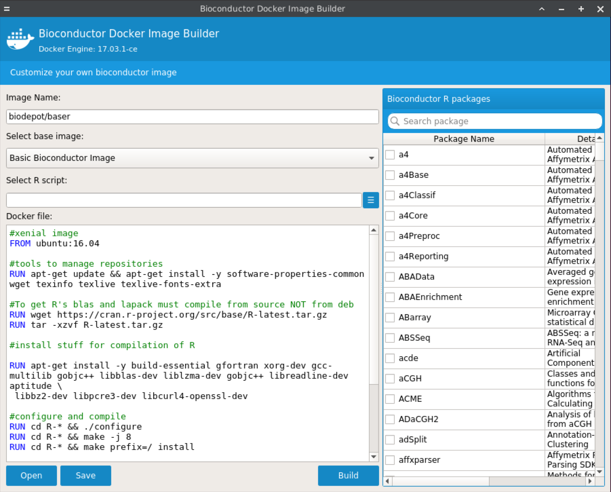
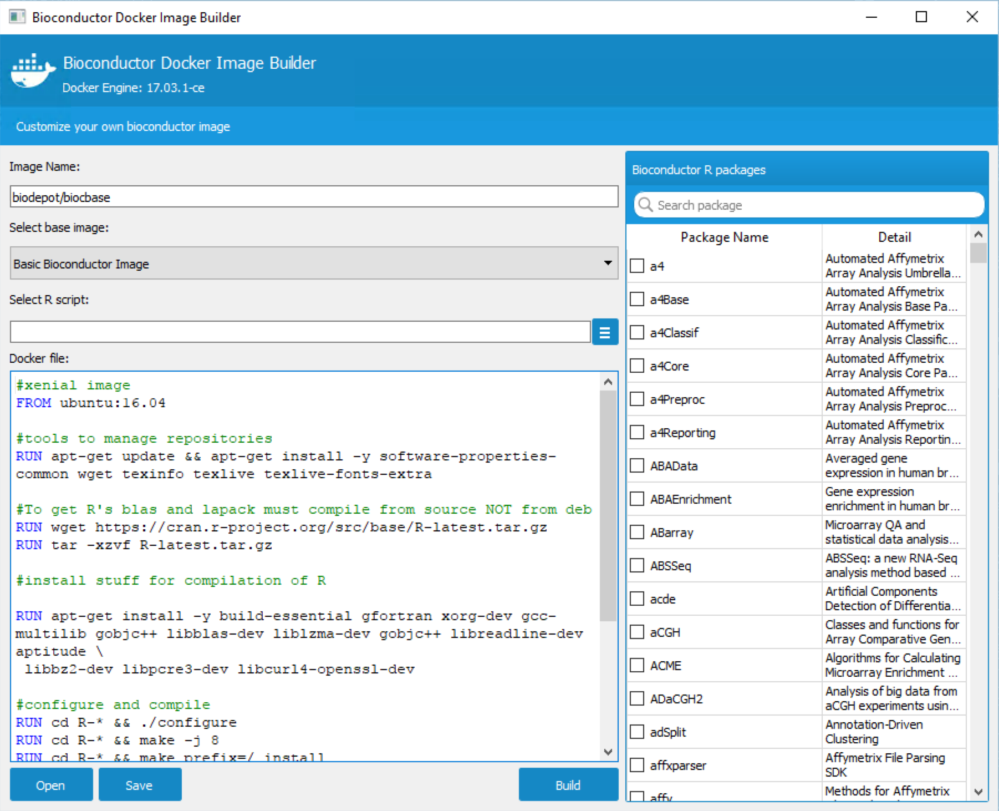

# Bioconductor docker image builder

## Requirements
- python 3.5
- PyQt5
- docker-py >= 2.0.0
- Docker engine >= 1.18.0

## Install requirements
- PyQt5 
```
  brew install pyqt5
```
- docker-py
```
  pip3 install docker
```


## How to run
- Run through docker
```
docker run --rm -it -v ${PWD}:/root/files -p 6080:6080 biodepot/bioc-builder
```
OR if you want to use [Build] feature:
```
docker run --rm -it -v ${PWD}:/root/files -v /var/run/docker.sock:/var/run/docker.sock -p 6080:6080 biodepot/bioc-builder
```
Then point a browser to **_localhost:6080_** for systems that run Docker natively

For windows and MacOS systems using VNs - find the the ip by
docker-machine ip
or
ping docker.local
and point the browser to <IP>:6080

- Command line
```
  python3 BiocImageBuilderMain.py
```
- macOs precompiled package

  Download docker-image-builder-app-macOS.zip from [Release](https://github.com/JMHOO/BiocImageBuilder/releases/tag/v0.4) tab


  If you encountered 'Docker Credential' error during the building, please follow:
  [docker-credential-helpers](https://github.com/docker/docker-credential-helpers)


## Embed your own Dockerfiles
  Put your Dockerfiles into [DockerFiles] directory and rename your Dockerfile to **_<title>.Dockerfile_**

## Demo
[](https://www.youtube.com/watch?v=HftUChnYytw)
 

## Screenshots
  On macOS
  
 
  On Ubuntu
  
  
  On windows
  
