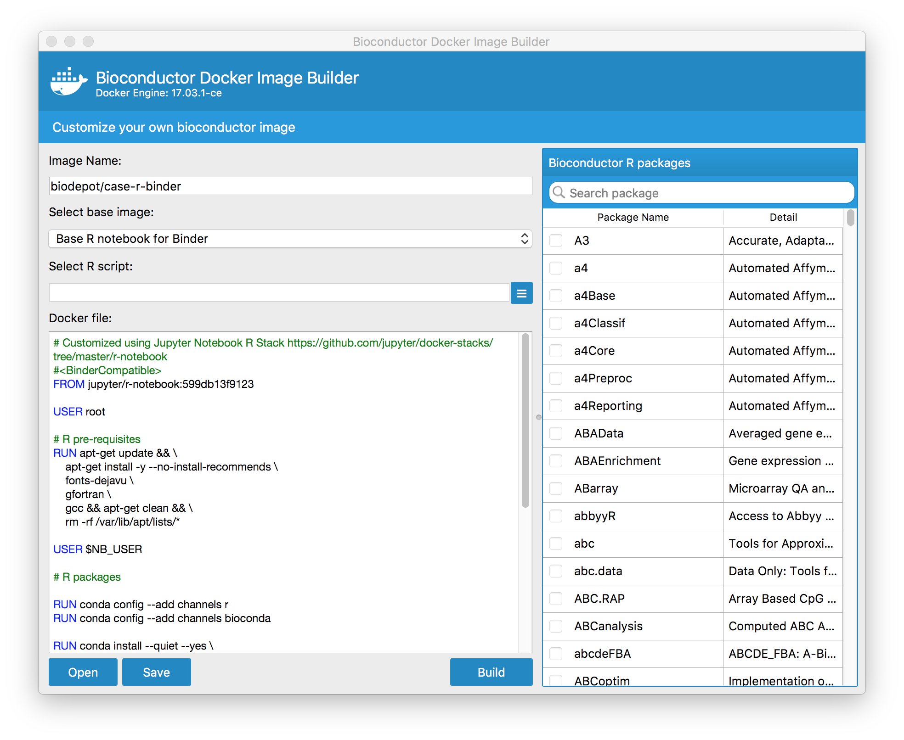

# Bioconductor docker image builder

## Requirements
- python 3.5
- PyQt5
- docker-py >= 2.0.0
- Docker engine >= 1.18.0

## Install requirements
- PyQt5 
```
  brew install pyqt5
```
- docker-py
```
  pip3 install docker
```
## How to run
- Command line
```
  python3 BiocImageBuilderMain.py
```
- macOs precompiled package

  Download docker-image-builder-app-macOS.zip from [Release](https://github.com/JMHOO/BiocImageBuilder/releases/tag/v0.1) tab


  If you encountered 'Docker Credential' error during the building, please follow:
  [docker-credential-helpers](https://github.com/docker/docker-credential-helpers)

## Embed your own Dockerfiles
  Put your Dockerfiles into [DockerFiles] directory and rename your Dockerfile to **_<title>.Dockerfile_**
  
  
  On macOS
  
 
  On Ubuntu
  
